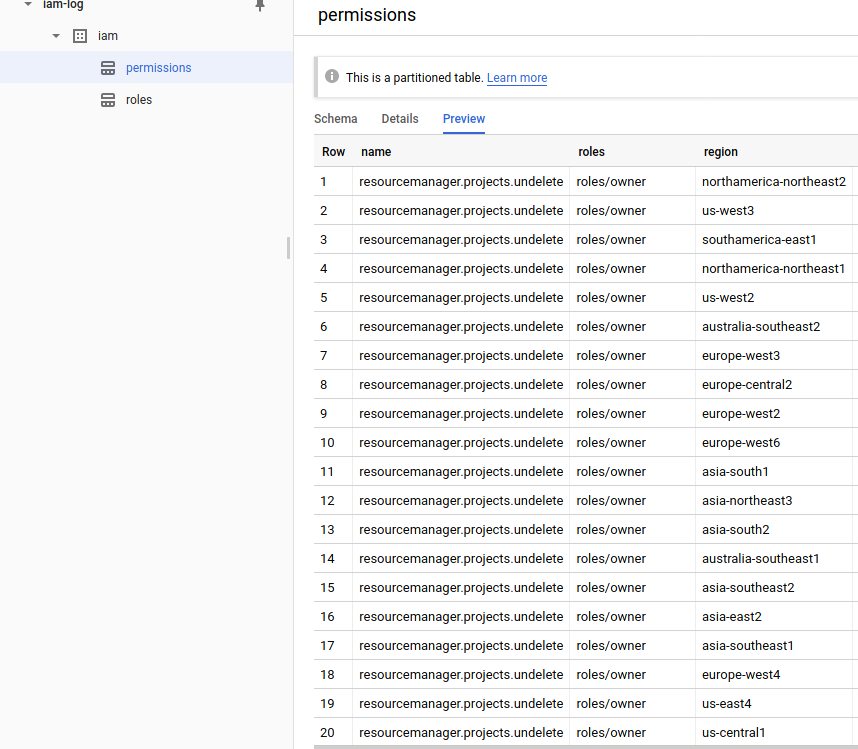
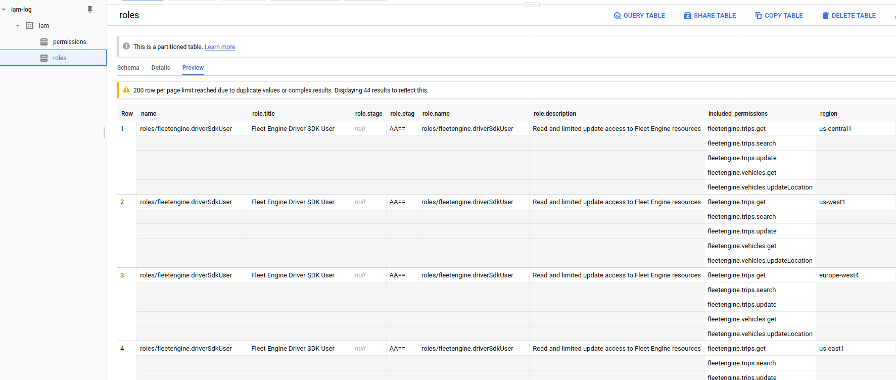
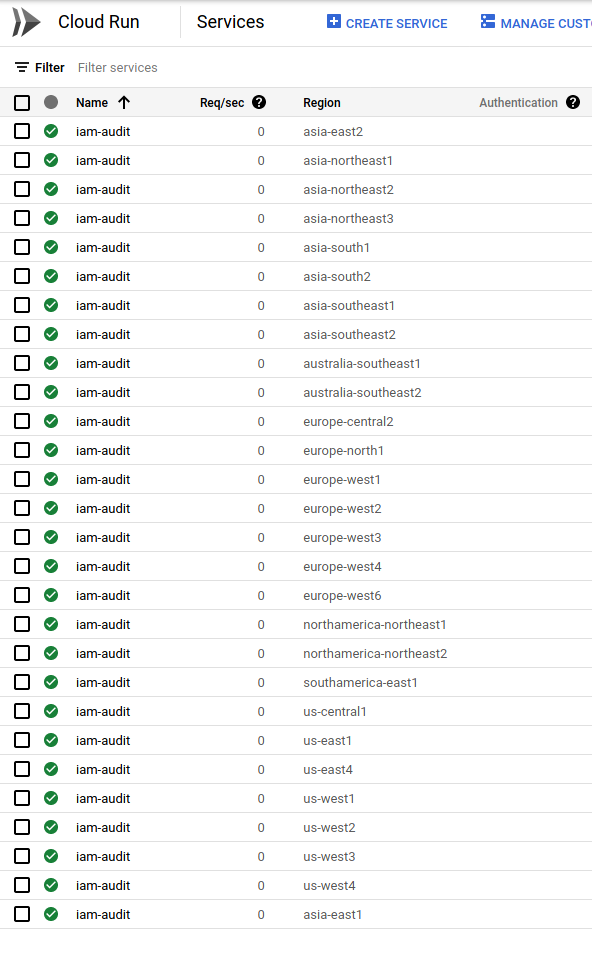
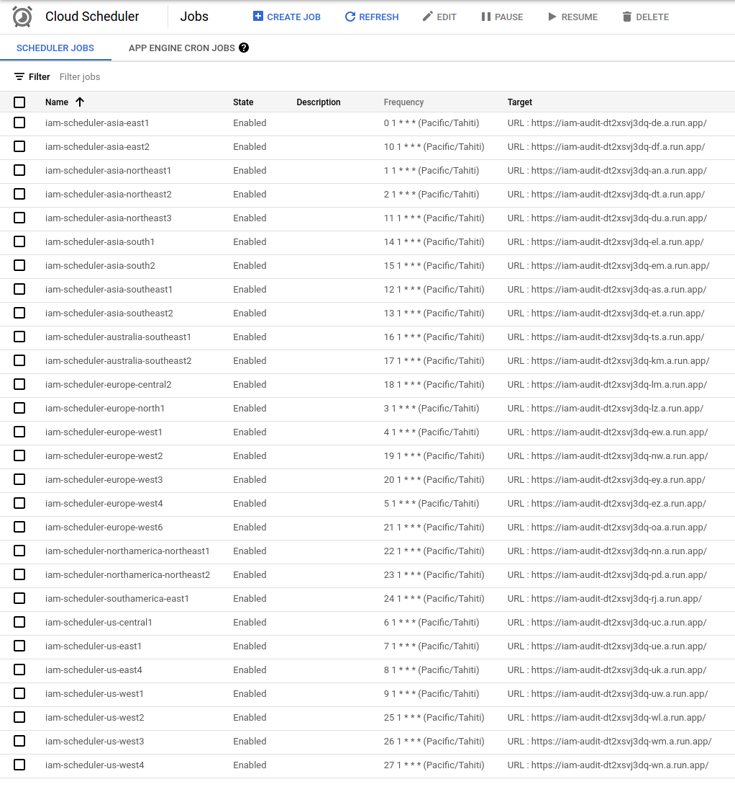

# Google Cloud IAM Roles-Permissions Public Dataset

Bigquery DataSet that contains a daily snapshot of all _Standard_ Google Cloud IAM Roles and Permissions.


Its like this:

1. Everyday at 1am bora-bora time, a cloud scheduler securely triggers  Cloud Run application in various global regions
2. Cloud Run iterates over all Roles and Permissions in Google Cloud
3. Cloud Run loads Permissions and Roles into two [daily partitioned tables](https://cloud.google.com/bigquery/docs/partitioned-tables#ingestion_time) in a *PUBLIC* BigQuery Dataset
4. Users query the two tables to see daily differences in new Roles and Permissions GCP published

> This is **not** an officially supported Google product

Here's the dataset: [https://console.cloud.google.com/bigquery?project=iam-log&p=iam-log&d=iam](https://console.cloud.google.com/bigquery?project=iam-log&p=iam-log&d=iam).  To use this, first [add the following project](https://cloud.google.com/bigquery/docs/bigquery-web-ui#pinning_adding_a_project) to the UI `iam-log`.  Once thats done, any query you issue will use the IAM dataset but bill your project for your own usage.

with tables:

- Permissions (`iam-log:iam.permissions`)

```json
bq show --format=prettyjson --schema iam-log:iam.permissions

[
  {
    "mode": "REQUIRED",
    "name": "name",
    "type": "STRING"
  },
  {
    "mode": "REQUIRED",
    "name": "region",
    "type": "STRING"
  },
  {
    "name": "title",
    "type": "STRING"
  },
  {
    "name": "description",
    "type": "STRING"
  },
  {
    "name": "stage",
    "type": "STRING"
  },
  {
    "name": "apiDisabled",
    "type": "BOOLEAN"
  },
  {
    "name": "customRolesSupportLevel",
    "type": "STRING"
  },
  {
    "name": "onlyInPredefinedRoles",
    "type": "BOOLEAN"
  },
  {
    "name": "primaryPermission",
    "type": "STRING"
  },
  {
    "mode": "REPEATED",
    "name": "roles",
    "type": "STRING"
  }
]
```


- Roles (`iam-log:iam.roles`)

```json
bq show --format=prettyjson --schema iam-log:iam.roles

[
  {
    "mode": "REQUIRED",
    "name": "name",
    "type": "STRING"
  },
  {
    "name": "title",
    "type": "STRING"
  },
  {
    "name": "stage",
    "type": "STRING"
  },
  {
    "name": "etag",
    "type": "STRING"
  },
  {
    "name": "deleted",
    "type": "BOOLEAN"
  },
  {
    "name": "description",
    "type": "STRING"
  },
  {
    "mode": "REPEATED",
    "name": "included_permissions",
    "type": "STRING"
  },
  {
    "mode": "REQUIRED",
    "name": "region",
    "type": "STRING"
  }
]
```



### But wait, i want to same thing for my custom roles in my org?

thats not a problem, you're free to run your own (see the `diy` section below).

Just modify the default cloud run image you deploy and set the `mode` variable appropriately 

- `organization`:  This will iterate over all custom roles at the organization level.  Remember to specify the `organization` value in the startup
- `project`:  This will iterate over all custom roles at _each_ the project level

```golang
mode        = flag.String("mode", "default", "Interation mode: organization|project|default")
organization = flag.String("organization", os.Getenv("ORGANIZATION_ID"), "OrganizationID")
```

Ofcourse, the cloud run SA you deploy will need access to view roles/permissions in your org (which is already granted through the IAM bindings below)


### BQ Samples

Here are some basic queries you can run

#### List all Partitions

```sql
bq query --nouse_legacy_sql  '
SELECT
  _PARTITIONTIME AS pt,
  FORMAT_TIMESTAMP("%Y%m%d", _PARTITIONTIME) AS partition_id
FROM
  iam-log.iam.permissions
GROUP BY
  _PARTITIONTIME
ORDER BY
  _PARTITIONTIME
'
```

#### Get Roles that include a Permission

Get all Roles which includes `storage.objects.get` permission on a given partition

```sql
bq query --nouse_legacy_sql  '
SELECT
  r1
FROM
  iam-log.iam.permissions AS d1, UNNEST(roles) r1
WHERE
  d1._PARTITIONTIME = TIMESTAMP("2021-09-22")
  AND d1.name = "storage.objects.get"
  AND d1.region = "us-central1"
'
```

#### Get Permissions included in a Role

Get all Permissions included in `roles/serverless.serviceAgent` permission on a given partition

```sql
bq query --nouse_legacy_sql  '
SELECT
  p1
FROM
  iam-log.iam.roles AS d1,
  UNNEST(included_permissions) p1
WHERE
  d1._PARTITIONTIME = TIMESTAMP("2021-09-22")
  AND d1.name = "roles/serverless.serviceAgent"
  AND d1.region = "us-central1"
'
```

#### Find which Roles added/removed permissions between two days

```sql
bq query --nouse_legacy_sql  '
SELECT
  d1.name
FROM
  iam-log.iam.roles AS d1
WHERE
  d1._PARTITIONTIME = TIMESTAMP("2021-09-23")
  AND d1.region = "us-central1"
  AND d1.name NOT IN (
  SELECT
    d2.name
  FROM
    iam-log.iam.roles AS d2
  WHERE
    d2._PARTITIONTIME = TIMESTAMP("2021-09-22")
    AND d2.region = "us-central1")
'
```

#### Find which Permissions added/removed permissions between two days

```sql
bq query --nouse_legacy_sql  '
SELECT
  d1.name
FROM
  iam-log.iam.permissions AS d1
WHERE
  d1._PARTITIONTIME = TIMESTAMP("2021-09-23")
  AND d1.region = "us-central1"  
  AND d1.name NOT IN (
  SELECT
    d2.name
  FROM
    iam-log.iam.permissions AS d2
  WHERE
    d2._PARTITIONTIME = TIMESTAMP("2021-09-22")
    AND d2.region = "us-central1")
'
```

#### Find which Permissions/Roles are visible between two regions on the same day

IAM permissions and roles rollout gradually in different regions.  The permission/role set retrieved by cloud run on any given day will reflect the state/view at that cell that cloud run connected to to retrieved the roles/permissions.  

To (somewhat imprecisely) account for this, this script deploys about several different cloud run instances in different [Cloud Run Regions](https://cloud.google.com/run/docs/locations) globally.  The idea is that each cloud run instance that is invoked will query the IAM Roles active sets within a region and then _from_ the [Role Response](https://cloud.google.com/iam/docs/reference/rest/v1/ListRolesResponse) populate the list of permissions.  However, a role may not found within that region which will omit any permissions that maybe visible.   To account for that, the permission list is retrieved *first* using a [iam.queryTestablePermissions()](https://cloud.google.com/iam/docs/reference/rest/v1/permissions/queryTestablePermissions) API call against the root organization resource (`//cloudresourcemanager.googleapis.com/organizations/`)

For each Role thats found using [IAM List Roles](https://cloud.google.com/iam/docs/reference/rest/v1/projects.roles/list) API call is invoked in each region the permissions back to what was found globally using queryTestablePermissions

It is ofcourse not a guarantee that the map reflects the region exactly since a CR instance can query a different region, but its likely that it stays in region and reflects a local map.   This script also just iterates over the following regions that are globally available.  If needed, tune this to your needs for wherever you deploy within your organization

```bash
export REGIONS=asia-east1,asia-northeast1,asia-northeast2,europe-north1,europe-west1,europe-west4,us-central1,us-east1,us-east4,us-west1,asia-east2,asia-northeast3,asia-southeast1,asia-southeast2,asia-south1,asia-south2,australia-southeast1,australia-southeast2,europe-central2,europe-west2,europe-west3,europe-west6,northamerica-northeast1,northamerica-northeast2,southamerica-east1,us-west2,us-west3,us-west4
```

Consider an iteration between two regions here for `us-west2` and `us-east1`.  


In `us-west2` has more _permissions_ visible while  `us-east1` was not able to find a specific role `roles/recommender.bigQueryCapacityCommitmentsViewer`.  (why the total number of roles is the same is describe a bit below.)

```log

A 2021-09-22T11:50:44.221238Z done 
A 2021-09-22T11:50:41.647731Z Uploading [4760] Permissions from region [us-west2] 
A 2021-09-22T11:50:37.918094Z Uploading [882] Roles from region [us-west2] 
A 2021-09-22T11:50:37.718748Z Generating BigQuery output 
A 2021-09-22T11:50:19.405329Z Getting Default Roles/Permissions 
A 2021-09-22T11:50:19.405305Z Found [4760] permissions on //cloudresourcemanager.googleapis.com/organizations/<organizationID>   
A 2021-09-22T11:50:01.464765Z / called for region us-west2 
A 2021-09-22T11:50:01.389747Z Starting Server.. 

A 2021-09-22T11:14:38.967673Z done 
A 2021-09-22T11:14:36.605246Z Uploading [4778] Permissions from region [us-east1] 
A 2021-09-22T11:14:32.656471Z Uploading [882] Roles from region [us-east1] 
A 2021-09-22T11:14:32.524652Z Generating BigQuery output 
A 2021-09-22T11:14:29.103389Z Error getting role name googleapi: Error 404: The role named roles/recommender.bigQueryCapacityCommitmentsViewer was not found., notFound 
A 2021-09-22T11:14:14.319069Z Getting Default Roles/Permissions 
A 2021-09-22T11:14:14.319052Z Found [4778] permissions on //cloudresourcemanager.googleapis.com/organizations/<organizationID>   
A 2021-09-22T11:14:01.572271Z / called for region us-east1 
A 2021-09-22T11:14:01.538825Z Starting Server.. 
```

Here is the query for the difference in permissions

```sql
bq query --nouse_legacy_sql  '
SELECT
  d1.name
FROM
  iam-log.iam.permissions AS d1
WHERE
  d1._PARTITIONTIME = TIMESTAMP("2021-09-22")
  AND d1.region = "us-east1"  
  AND d1.name NOT IN (
  SELECT
    d2.name
  FROM
    iam-log.iam.permissions AS d2
  WHERE
    d2._PARTITIONTIME = TIMESTAMP("2021-09-22")
    AND d2.region = "us-west2")
'

    +---------------------------------------------+
    |                    name                     |
    +---------------------------------------------+
    | integrations.securityIntegrationVers.list   |
    | integrations.securityExecutions.cancel      |
    | integrations.securityAuthConfigs.create     |
    | integrations.securityAuthConfigs.update     |
    | integrations.securityAuthConfigs.get        |
    | integrations.securityExecutions.get         |
    | integrations.securityIntegTempVers.get      |
    | integrations.securityAuthConfigs.list       |
    | integrations.securityIntegTempVers.list     |
    | integrations.securityIntegrations.list      |
    | integrations.securityIntegrationVers.create |
    | integrations.securityAuthConfigs.delete     |
    | integrations.securityIntegrationVers.deploy |
    | integrations.securityIntegrationVers.get    |
    | integrations.securityExecutions.list        |
    | integrations.securityIntegTempVers.create   |
    | integrations.securityIntegrations.invoke    |
    | integrations.securityIntegrationVers.update |
    +---------------------------------------------+
```

For roles, consider the query below which lists the roles that are visible between 

```sql
bq query --nouse_legacy_sql  '
SELECT
  d1.name
FROM
  iam-log.iam.roles AS d1
WHERE
  d1._PARTITIONTIME = TIMESTAMP("2021-09-22")
  AND d1.region = "us-west2"  
  AND d1.name NOT IN (
  SELECT
    d2.name
  FROM
    iam-log.iam.roles AS d2
  WHERE
    d2._PARTITIONTIME = TIMESTAMP("2021-09-22")
    AND d2.region = "us-east1")
'

    +-----------------------------------------------------+
    |                        name                         |
    +-----------------------------------------------------+
    | roles/recommender.bigQueryCapacityCommitmentsViewer |
    +-----------------------------------------------------+
```

Confusingly enough, the total number of roles is the same on both regions...thats because `us-east1` happens to have an extra role visible

```sql
bq query --nouse_legacy_sql  '
SELECT
  d1.name
FROM
  iam-log.iam.roles AS d1
WHERE
  d1._PARTITIONTIME = TIMESTAMP("2021-09-22")
  AND d1.region = "us-east1"  
  AND d1.name NOT IN (
  SELECT
    d2.name
  FROM
    iam-log.iam.roles AS d2
  WHERE
    d2._PARTITIONTIME = TIMESTAMP("2021-09-22")
    AND d2.region = "us-west2")
'

    +---------------------------------------------+
    |                    name                     |
    +---------------------------------------------+
    | roles/integrations.securityIntegrationAdmin |
    +---------------------------------------------+
```

#### Find number of Permissions visible per Region

```sql
bq query --nouse_legacy_sql  '
SELECT
  d1.region,
  COUNT(*) AS num_permissions
FROM
  iam-log.iam.permissions AS d1
WHERE
  d1._PARTITIONTIME = TIMESTAMP("2021-09-22")
GROUP BY
  d1.region
ORDER BY 
  num_permissions DESC, d1.region
'

    +-------------------------+-----------------+
    |         region          | num_permissions |
    +-------------------------+-----------------+
    | europe-central2         |            4778 |
    | europe-north1           |            4778 |
    | europe-west1            |            4778 |
    | europe-west2            |            4778 |
    | europe-west3            |            4778 |
    | europe-west4            |            4778 |
    | europe-west6            |            4778 |
    | northamerica-northeast1 |            4778 |
    | northamerica-northeast2 |            4778 |
    | southamerica-east1      |            4778 |
    | us-east1                |            4778 |
    | us-east4                |            4778 |
    | asia-east1              |            4760 |
    | asia-east2              |            4760 |
    | asia-northeast1         |            4760 |
    | asia-northeast2         |            4760 |
    | asia-northeast3         |            4760 |
    | asia-south1             |            4760 |
    | asia-south2             |            4760 |
    | asia-southeast1         |            4760 |
    | asia-southeast2         |            4760 |
    | australia-southeast1    |            4760 |
    | australia-southeast2    |            4760 |
    | us-central1             |            4760 |
    | us-west1                |            4760 |
    | us-west2                |            4760 |
    | us-west3                |            4760 |
    | us-west4                |            4760 |
    +-------------------------+-----------------+
```

#### Find number of Roles visible per Region

```sql
bq query --nouse_legacy_sql  '
SELECT
  d1.region,
  COUNT(*) AS num_roles
FROM
  iam-log.iam.roles AS d1
WHERE
  d1._PARTITIONTIME = TIMESTAMP("2021-09-22")
GROUP BY
  d1.region
ORDER BY 
  num_roles DESC, d1.region
'

+-------------------------+-----------+
|         region          | num_roles |
+-------------------------+-----------+
| asia-east1              |       885 |
| us-west3                |       885 |
| asia-south2             |       884 |
| europe-north1           |       884 |
| europe-central2         |       883 |
| europe-west3            |       883 |
| europe-west6            |       883 |
| northamerica-northeast1 |       883 |
| asia-east2              |       882 |
| asia-northeast1         |       882 |
| asia-northeast2         |       882 |
| asia-northeast3         |       882 |
| asia-south1             |       882 |
| asia-southeast2         |       882 |
| australia-southeast1    |       882 |
| australia-southeast2    |       882 |
| europe-west1            |       882 |
| southamerica-east1      |       882 |
| us-central1             |       882 |
| us-east1                |       882 |
| us-west1                |       882 |
| us-west2                |       882 |
| europe-west2            |       881 |
| europe-west4            |       881 |
| northamerica-northeast2 |       881 |
| us-east4                |       881 |
| us-west4                |       881 |
| asia-southeast1         |       880 |
+-------------------------+-----------+
```

---

The following section details how to setup your own dataset:

### DIY

These steps requires org-level privileges just to set cloud run's service account the ability to read permissions/roles.

First pick a project

```bash
export PROJECT_ID=`gcloud config get-value core/project`
export PROJECT_NUMBER=`gcloud projects describe $PROJECT_ID --format="value(projectNumber)"`

# get the organizationID:
$ gcloud organizations list
    DISPLAY_NAME               ID  DIRECTORY_CUSTOMER_ID
    esodemoapp2.com  673208786098              C023zw3x8

export ORGANIZATION_ID=673208786098

# enable some services
gcloud services enable run.googleapis.com
gcloud services enable cloudresourcemanager.googleapis.com
gcloud services enable bigquery.googleapis.com
gcloud services enable iam.googleapis.com  

# Cloud Scheduler uses appengine apis
gcloud services enable appengine.googleapis.com
gcloud services enable cloudscheduler.googleapis.com

# these are the ones i ended up with
gcloud services list 
  NAME                                 TITLE
  appengine.googleapis.com             App Engine Admin API
  bigquery.googleapis.com              BigQuery API
  bigquerystorage.googleapis.com       BigQuery Storage API
  cloudapis.googleapis.com             Google Cloud APIs
  clouddebugger.googleapis.com         Cloud Debugger API
  cloudresourcemanager.googleapis.com  Cloud Resource Manager API
  cloudscheduler.googleapis.com        Cloud Scheduler API
  cloudtrace.googleapis.com            Cloud Trace API
  containerregistry.googleapis.com     Container Registry API
  datastore.googleapis.com             Cloud Datastore API
  iam.googleapis.com                   Identity and Access Management (IAM) API
  iamcredentials.googleapis.com        IAM Service Account Credentials API
  logging.googleapis.com               Cloud Logging API
  monitoring.googleapis.com            Cloud Monitoring API
  pubsub.googleapis.com                Cloud Pub/Sub API
  run.googleapis.com                   Cloud Run Admin API
  servicemanagement.googleapis.com     Service Management API
  serviceusage.googleapis.com          Service Usage API
  sql-component.googleapis.com         Cloud SQL
  storage-api.googleapis.com           Google Cloud Storage JSON API
  storage-component.googleapis.com     Cloud Storage
  storage.googleapis.com               Cloud Storage API
```

#### Create Cloud Run application

```bash
# build and deploy your own app
docker build -t gcr.io/$PROJECT_ID/iam_audit .
docker push gcr.io/$PROJECT_ID/iam_audit

# this is the svc account cloud run runs as
gcloud iam service-accounts create iam-audit-account --display-name "IAM Audit Service Account"

# allow Cloud Run's root svc account the ability to impersonate and get tokens for your custom SA
gcloud iam service-accounts add-iam-policy-binding iam-audit-account@$PROJECT_ID.iam.gserviceaccount.com \
   --member=serviceAccount:service-$PROJECT_NUMBER@serverless-robot-prod.iam.gserviceaccount.com  --role=roles/run.serviceAgent

export REGIONS=asia-east1,asia-northeast1,asia-northeast2,europe-north1,europe-west1,europe-west4,us-central1,us-east1,us-east4,us-west1,asia-east2,asia-northeast3,asia-southeast1,asia-southeast2,asia-south1,asia-south2,australia-southeast1,australia-southeast2,europe-central2,europe-west2,europe-west3,europe-west6,northamerica-northeast1,northamerica-northeast2,southamerica-east1,us-west2,us-west3,us-west4

./deploy_run.sh
```

Add IAM permissions to CloudRun to cloud run.  These steps should be run as an admin

```bash
gcloud organizations add-iam-policy-binding $ORGANIZATION_ID \
   --member=serviceAccount:iam-audit-account@$PROJECT_ID.iam.gserviceaccount.com --role=roles/iam.organizationRoleViewer

gcloud organizations add-iam-policy-binding $ORGANIZATION_ID \
  --member=serviceAccount:iam-audit-account@$PROJECT_ID.iam.gserviceaccount.com --role=roles/orgpolicy.policyViewer

gcloud projects  add-iam-policy-binding $PROJECT_ID \
   --member=serviceAccount:iam-audit-account@$PROJECT_ID.iam.gserviceaccount.com --role=roles/bigquery.jobUse
```

Since the `$REGION` contains all available regions, there will be one Run instance per region



Note, you can also query the stdout of each invocation of Cloud Run from another public dataset which is a [Logs->BQ Logging Export](https://cloud.google.com/logging/docs/export/bigquery)

* `run_googleapis_com_stdout` stdout of each invocation

#### Create Cloud Scheduler

```bash
# this is the service account cloud scheduler runs as
gcloud iam service-accounts create schedulerunner --display-name="Task Schedule Runner"

# allow Cloud Schedulers's root svc account the ability to impersonate and get tokens for your custom SA
gcloud iam service-accounts add-iam-policy-binding  schedulerunner@$PROJECT_ID.iam.gserviceaccount.com \
    --member=serviceAccount:service-$PROJECT_NUMBER@gcp-sa-cloudscheduler.iam.gserviceaccount.com --role=roles/cloudscheduler.serviceAgent

./deploy_scheduler.sh
```

Note, if you trigger cloud run multiple times over a partition, duplicate roles/permissions will be added to BQ since its an append.  To account for that, you could construct a BQ query to look for DISTINCT.  (again, i don't know enough sql to show that)

Since the `$REGION` contains all available regions, there will be one Scheduler pointing to Cloud Run per per region



#### Create Dataset

```bash
# configure each partition for 30days
bq --location=US mk --dataset --default_partition_expiration=2592000 iam

# export the permission set the BQ dataset has
bq show --format=prettyjson iam > /tmp/mydataset.json
```

edit `/tmp/mydataset.json`, add (remember to actually replace `$PROJECT_ID`)

```json
    {
      "role": "roles/bigquery.admin",
      "userByEmail": "iam-audit-account@$PROJECT_ID.iam.gserviceaccount.com"
    },
```

```bash
bq update --source /tmp/mydataset.json $PROJECT_ID:iam
```

---


then sit, relax and wait here till 1am bora-bora time (yup, i took that picture)


