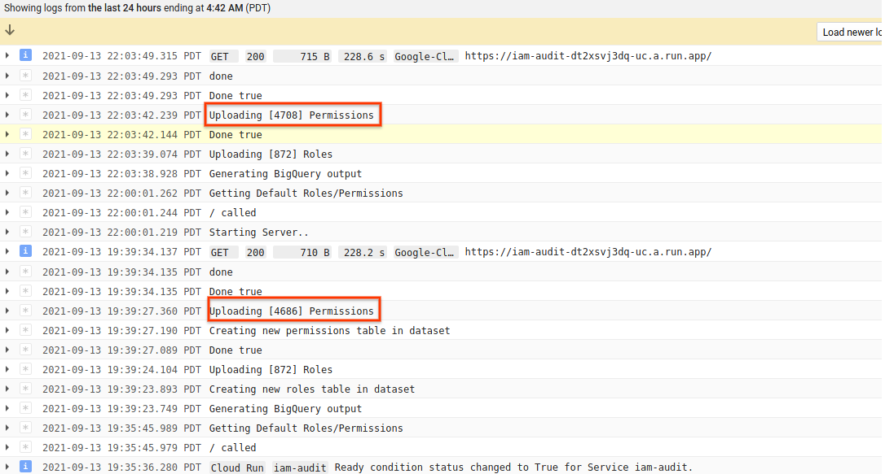

# Google Cloud IAM Roles-Permissions Public Dataset

Bigquery DataSet that contains a daily snapshot of all _Standard_ Google Cloud IAM Roles and Permissions.


Its like this:

1. Everyday at 1am bora-bora time, a cloud scheduler securely triggers a Cloud Run application
2. Cloud Run iterates over all Roles and Permissions Google Cloud Publishes
3. Cloud Run loads Permissions and Roles into two [daily partitioned tables](https://cloud.google.com/bigquery/docs/partitioned-tables#ingestion_time) in a *PUBLIC* BigQuery Dataset
4. Users query the two tables to see daily differences in new Roles and Permissions GCP published

Here' the dataset: [https://console.cloud.google.com/bigquery?project=iam-log&p=iam-log&d=iam](https://console.cloud.google.com/bigquery?project=iam-log&p=iam-log&d=iam)

with tables:

- Permissions (`iam-log:iam.permissions`)

```json
$ bq show --format=prettyjson --schema iam-log:iam.permissions
[
  {
    "mode": "REQUIRED",
    "name": "name",
    "type": "STRING"
  },
  {
    "mode": "REPEATED",
    "name": "roles",
    "type": "STRING"
  }
]
```

- Roles (`iam-log:iam.roles`)

```json
$ bq show --format=prettyjson --schema iam-log:iam.roles
[
  {
    "mode": "REQUIRED",
    "name": "name",
    "type": "STRING"
  },
  {
    "fields": [
      {
        "name": "title",
        "type": "STRING"
      },
      {
        "name": "stage",
        "type": "STRING"
      },
      {
        "name": "etag",
        "type": "STRING"
      },
      {
        "name": "name",
        "type": "STRING"
      },
      {
        "name": "description",
        "type": "STRING"
      }
    ],
    "name": "role",
    "type": "RECORD"
  },
  {
    "mode": "REPEATED",
    "name": "included_permissions",
    "type": "STRING"
  }
]
```

### But wait, i want to same thing for my custom roles in my org?

thats not a problem, you're free to run your own (see the `diy` section below).

Just modify the default cloud run image you deploy and set the `mode` variable appropriately 

- `organization`:  This will iterate over all custom roles at the organization level.  Remember to specify the `organization` value in the startup
- `project`:  This will iterate over all custom roles at _each_ the project level

```golang
mode        = flag.String("mode", "default", "Interation mode: organization|project|default")
organization = flag.String("organization", "", "OrganizationID")
```

Ofcourse, the cloud run SA you deploy will need access to view roles/permissions in your org (which is already granted through the IAM bindings below)


> This is **not** an officially supported Google product

### BQ Samples

Here are some basic queries you can run

#### List all Partitions

```sql
SELECT
  _PARTITIONTIME AS pt,
  FORMAT_TIMESTAMP("%Y%m%d", _PARTITIONTIME) AS partition_id
FROM
  `iam-log.iam.permissions`
GROUP BY
  _PARTITIONTIME
ORDER BY
  _PARTITIONTIME
```

#### Get Roles that include a Permission

Get all Roles which includes `storage.objects.get` permission on a given partition

```sql
SELECT
  d1.name,
  d1.roles
FROM
  `iam-log.iam.permissions` AS d1
WHERE
  d1._PARTITIONTIME = TIMESTAMP('2021-09-14')
  AND d1.name = 'storage.objects.get'
```

#### Get Permissions included in a Role

Get all Permissions included in `roles/serverless.serviceAgent` permission on a given partition

```sql
SELECT
  d1.name,
  d1.included_permissions
FROM
  `iam-log.iam.roles` as d1
WHERE
  d1._PARTITIONTIME = TIMESTAMP('2021-09-14')
  AND d1.name = "roles/serverless.serviceAgent"
```

#### Get Permissions differences between two days

(i don't know enough sql to do this)

```sql
```

#### Find which roles added/removed permissions between two days

(i don't know enough sql to do this)

```sql
```

#### Find which permissions were added between two days

(i don't know enough sql to do this)

```sql
```

Note, i happened to see this same issue while developing this.  The following shows two runs (one manual and one scheduled) that surfaced a new permission sequence but no new roles:



---

The following section details how to setup your own dataset:

### DIY

These steps requires org-level privleges just to set cloud run's service account the ability to read permissions/roles.

First pick a project

```bash
export PROJECT_ID=`gcloud config get-value core/project`
export PROJECT_NUMBER=`gcloud projects describe $PROJECT_ID --format="value(projectNumber)"`


# get the organizationID:
$ gcloud organizations list
    DISPLAY_NAME               ID  DIRECTORY_CUSTOMER_ID
    esodemoapp2.com  673208786098              C023zw3x8

export ORGANIZATION_ID=673208786098

# enable some services
gcloud services enable run.googleapis.com
gcloud services enable cloudresourcemanager.googleapis.com
gcloud services enable bigquery.googleapis.com
gcloud services enable iam.googleapis.com  

# Cloud Scheduler uses appengine apis
gcloud services enable appengine.googleapis.com
gcloud services enable cloudscheduler.googleapis.com

# these are the ones i ended up with
gcloud services list 
  NAME                                 TITLE
  appengine.googleapis.com             App Engine Admin API
  bigquery.googleapis.com              BigQuery API
  bigquerystorage.googleapis.com       BigQuery Storage API
  cloudapis.googleapis.com             Google Cloud APIs
  clouddebugger.googleapis.com         Cloud Debugger API
  cloudresourcemanager.googleapis.com  Cloud Resource Manager API
  cloudscheduler.googleapis.com        Cloud Scheduler API
  cloudtrace.googleapis.com            Cloud Trace API
  containerregistry.googleapis.com     Container Registry API
  datastore.googleapis.com             Cloud Datastore API
  iam.googleapis.com                   Identity and Access Management (IAM) API
  iamcredentials.googleapis.com        IAM Service Account Credentials API
  logging.googleapis.com               Cloud Logging API
  monitoring.googleapis.com            Cloud Monitoring API
  pubsub.googleapis.com                Cloud Pub/Sub API
  run.googleapis.com                   Cloud Run Admin API
  servicemanagement.googleapis.com     Service Management API
  serviceusage.googleapis.com          Service Usage API
  sql-component.googleapis.com         Cloud SQL
  storage-api.googleapis.com           Google Cloud Storage JSON API
  storage-component.googleapis.com     Cloud Storage
  storage.googleapis.com               Cloud Storage API
```

#### Create Cloud Run application

```bash
# build and deploy your own app
docker build -t gcr.io/$PROJECT_ID/iam_audit .
docker push gcr.io/$PROJECT_ID/iam_audit

# this is the svc account cloud run runs as
gcloud iam service-accounts create iam-audit-account --display-name "IAM Audit Service Account"

# allow Cloud Run's root svc account the ability to impersonate and get tokens for your custom SA
gcloud iam service-accounts add-iam-policy-binding iam-audit-account@$PROJECT_ID.iam.gserviceaccount.com \
   --member=serviceAccount:service-$PROJECT_NUMBER@serverless-robot-prod.iam.gserviceaccount.com  --role=roles/run.serviceAgent

# deploy the app, note the BQ_DATASET and BQ_PROEJCTID values. Thats the dataset and project the updates will get written to
gcloud run deploy iam-audit  --image gcr.io/$PROJECT_ID/iam_audit  \
  --region us-central1  --platform=managed \
  --service-account=iam-audit-account@$PROJECT_ID.iam.gserviceaccount.com  --set-env-vars "BQ_DATASET=iam"  --set-env-vars "BQ_PROJECTID=$PROJECT_ID"  -q

export RUN_URL=`gcloud run services describe iam-audit --format="value(status.address.url)"`
```

Add IAM permissions to CloudRun to cloud run.  These steps should be run as an admin

```bash
gcloud organizations add-iam-policy-binding $ORGANIZATION_ID \
   --member=serviceAccount:iam-audit-account@$PROJECT_ID.iam.gserviceaccount.com --role=roles/iam.organizationRoleViewer

gcloud organizations add-iam-policy-binding $ORGANIZATION_ID \
  --member=serviceAccount:iam-audit-account@$PROJECT_ID.iam.gserviceaccount.com --role=roles/orgpolicy.policyViewer

gcloud projects  add-iam-policy-binding $PROJECT_ID \
   --member=serviceAccount:iam-audit-account@$PROJECT_ID.iam.gserviceaccount.com --role=roles/bigquery.jobUse
```


#### Create Cloud Scheduler

```bash
# this is the service account cloud scheduler runs as
gcloud iam service-accounts create schedulerunner --display-name="Task Schedule Runner"

# allow Cloud Schedulers's root svc account the ability to impersonate and get tokens for your custom SA
gcloud iam service-accounts add-iam-policy-binding  schedulerunner@$PROJECT_ID.iam.gserviceaccount.com \
    --member=serviceAccount:service-$PROJECT_NUMBER@gcp-sa-cloudscheduler.iam.gserviceaccount.com --role=roles/cloudscheduler.serviceAgent

# set permissions to allow cloud scheduler to call cloud run
gcloud run  services add-iam-policy-binding iam-audit --region=us-central1 \
  --member=serviceAccount:schedulerunner@$PROJECT_ID.iam.gserviceaccount.com --role=roles/run.invoker

# run every morning at 1am bora-bora time
gcloud scheduler jobs create http iam-scheduler --http-method=GET --schedule "0 1 * * *" \
  --attempt-deadline=420s --time-zone="Pacific/Tahiti" \
  --oidc-service-account-email=schedulerunner@$PROJECT_ID.iam.gserviceaccount.com  \
  --oidc-token-audience=$RUN_URL --uri=$RUN_URL
```

Note, if you trigger cloud run multiple times over a partition, duplicate roles/permissions will be added to BQ since its an append.  To account for that, you could construct a BQ query to look for DISTINCT.  (again, i don't know enough sql to show that)

#### Create Dataset

```bash
bq --location=US mk iam

# export the permission set the BQ dataset has
bq show --format=prettyjson iam > /tmp/mydataset.json
```

edit `/tmp/mydataset.json`, add (remember to actually replace `$PROJECT_ID`)

```json
    {
      "role": "roles/bigquery.admin",
      "userByEmail": "iam-audit-account@$PROJECT_ID.iam.gserviceaccount.com"
    },
```

```bash
bq update --source /tmp/mydataset.json $PROJECT_ID:iam
```

---


then sit, relax and wait here till 1am bora-bora time


